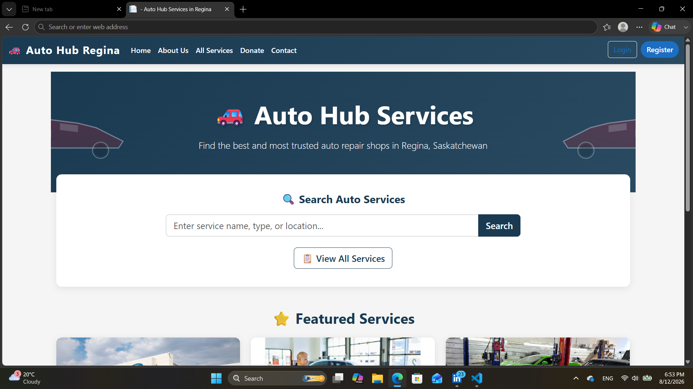
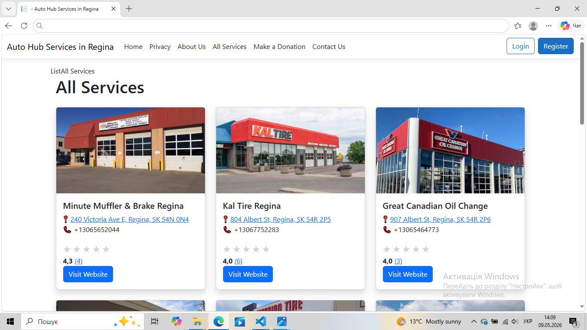
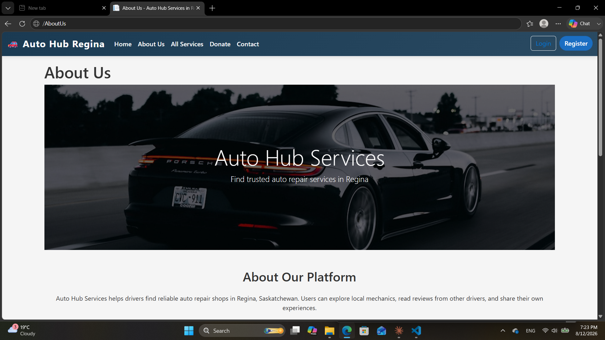
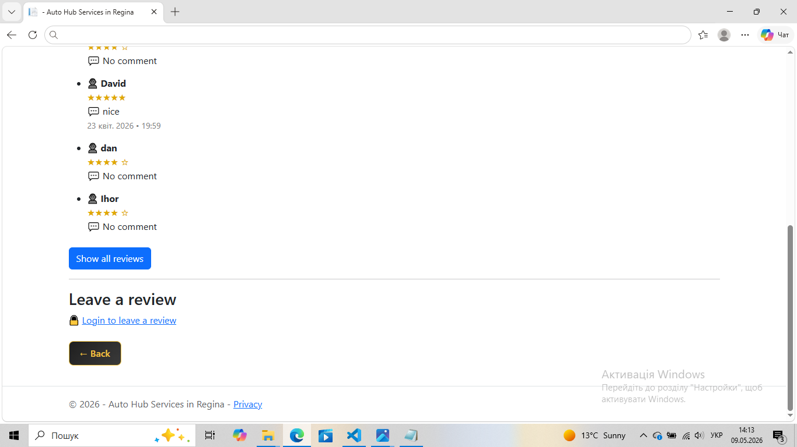
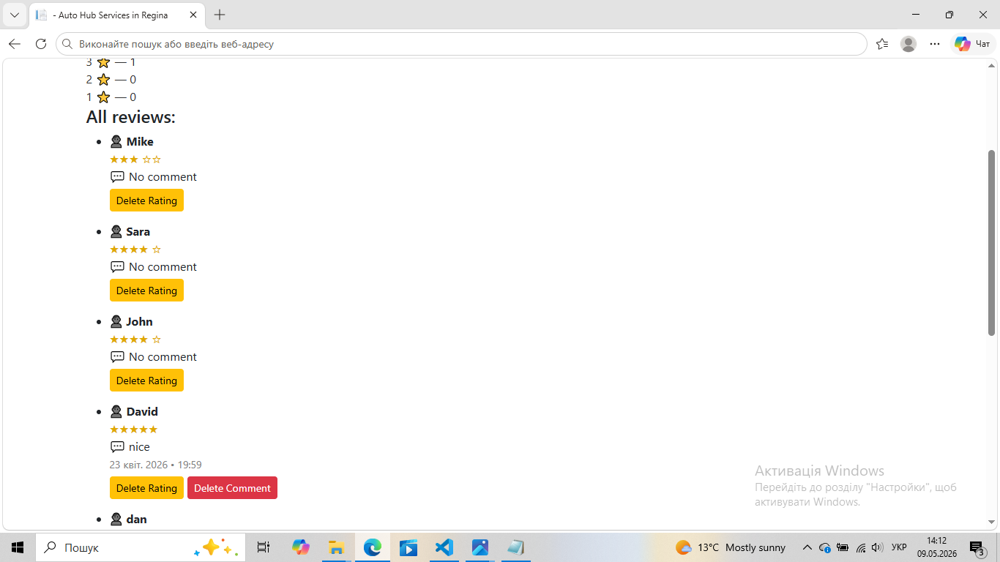
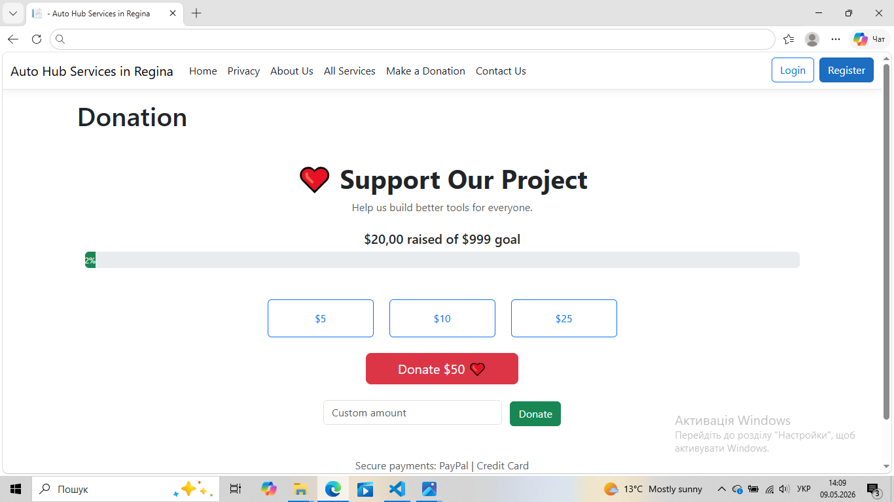
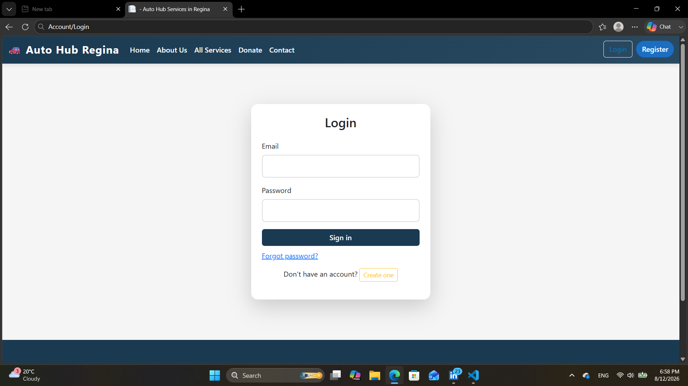
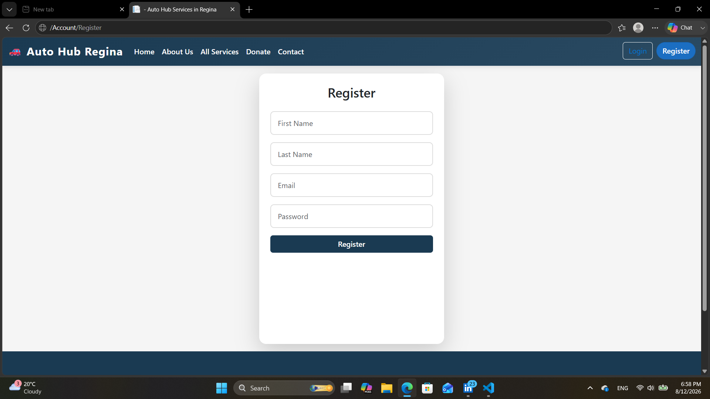
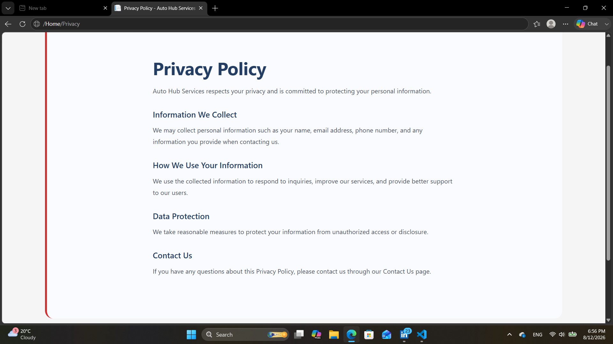

# Regina Auto Hub

A web platform for finding trusted auto repair shops in Regina, Saskatchewan, Canada.

## Features

- User registration and authentication
- Ratings and reviews system
- Auto service listings
- Search functionality
- Responsive design
- User-friendly interface
- Role-based authorization
- Admin panel
-Comments system

## Technologies Used

- ASP.NET Core MVC
- Entity Framework Core
- SQLite
- C#
- Bootstrap
- HTML/CSS/JavaScript

## Screenshots

### Home Page

### Services Page

### About Page

### Reviews System

### Admin Controls

### Donation Page

### Login Page

### Register Page

### Privacy Page

## Getting Started

1. Clone repository
2. Open solution in Visual Studio or VS Code
3. Restore NuGet packages
4. Configure appsettings.json
5. Run migrations
6. Start application

## Project Status

This project is actively being improved and updated.
